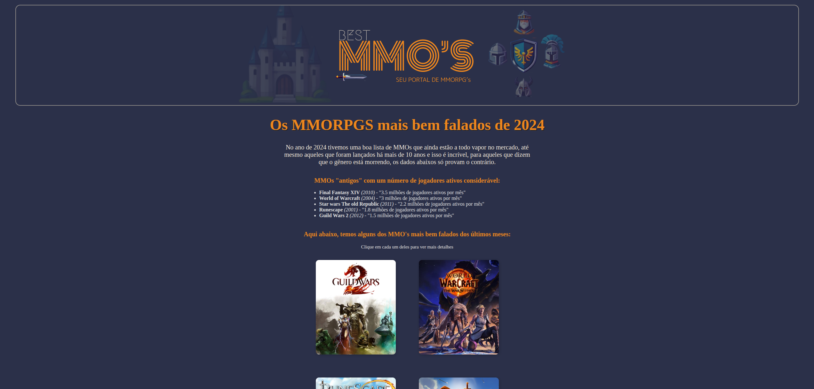

<div align="center">
  <h1>🧙‍♂️ BestMMORPGs - Landing Page ⚔️</h1>
  <p>Landing page desenvolvida como projeto acadêmico para apresentar e comparar alguns dos MMORPGs mais populares.</p>
  
  
  <br>

  
  
  

  <br><br>

  
  
  
  

</div>

---

# 📖 Sobre o projeto

O **BestMMORPGs** é uma landing page desenvolvida com o objetivo de apresentar alguns dos MMORPGs mais populares, permitindo que os usuários conheçam suas características e comparem informações antes de decidir qual jogo explorar.

O projeto foi desenvolvido como atividade acadêmica na disciplina de **Linguagem de Marcação**, focando na prática de estruturação semântica, estilização e interatividade básica com JavaScript.

---

# ✨ Funcionalidades

- 🎮 Catálogo com alguns dos MMORPGs mais populares
- 📊 Tabela comparativa com vantagens e desvantagens dos jogos
- 🗳️ Formulário para votação do MMORPG que o usuário pretende jogar em 2025
- 🌐 Links que direcionam para os sites oficiais dos jogos
- 📱 Layout responsivo para diferentes dispositivos

---

# 🛠️ Tecnologias utilizadas

- **HTML5** — Estrutura semântica das páginas
- **CSS3** — Estilização visual e layout responsivo
- **JavaScript** — Interatividade e manipulação do DOM
- **Figma** — Prototipação e criação de elementos visuais
- **Media Queries** — Adaptação do layout em diferentes tamanhos de tela

---

# 📂 Estrutura do projeto

``` bash
bestmmorpgs/
│
├── index.html
│
├── css/
│ └── style.css
│
├── js/
│ └── script.js
│
└── assets/
└── images/
```

---

# 🎯 Objetivo do projeto

Este projeto foi desenvolvido como parte das atividades da disciplina **Linguagem de Marcação**, com o objetivo de aplicar na prática conceitos fundamentais de desenvolvimento web, incluindo:

- Estrutura semântica com HTML
- Estilização com CSS
- Responsividade
- Interatividade com JavaScript

---

# 👨‍💻 Autores

**Álex Robert Braz**  
Estudante de **Sistemas para Internet – IFPB**

- 💻 GitHub: https://github.com/robertifpb
- 💼 LinkedIn: https://www.linkedin.com/in/arobertdev/

**Luiz Felipe Alves de Sena**

Projeto desenvolvido sob orientação do **Professor Alex Cabral**.

---

⭐ Se você gostou do projeto, considere deixar uma **star no repositório**!